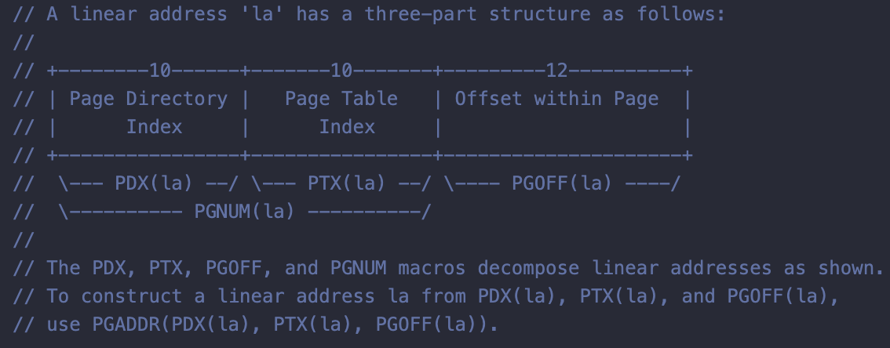

# Part 2: Virtual Memory

## Homework

To be finished :)

## Functions to Implement

Here we have to implement these 5 functions:
```c
pgdir_walk()
boot_map_region()
page_lookup()
page_remove()
page_insert()
```
### 1. pgdir_walk()

The function is to return a pointer to the page table entry (PTE) for linear address ``va``. All the cases are:
- If the relevant page exists, it returns the kernel virtual address.
- If the relevant page does not exist:
  - If ``create == false``, it returns ``NULL``.
  - Else it allocates a new page with ``page_alloc``.
    - If the allocation fails, it returns ``NULL``.
    - Otherwise, the new page's reference count is incremented, the page is cleared, and it returns a pointer into the new page table page.

Note that there are two predefined enums ``true`` and ``false`` in ``inc/types.h``:
```c
// Represents true-or-false values
typedef _Bool bool;
enum { false, true };
```
  
To implement this function, you will find information in ``inc/mmu.h`` helpful:



The picture above shows the paging data structures and constants. 

First we have to declare two variables ``pdx`` and ``ptx`` to detect a possible existed relevant page:
```c
uint32_t pdx = PDX(va); // Page directory index
uint32_t ptx = PTX(va); // Page table index
```

Not only have we to check if ``pgdir`` is a valid address and if there is data in the page directory, but we also have to check whether the page is present.
```c
pgdir != NULL && (pgdir[pdx] & PTE_P)
```
If the case falls into the case, convert the page to the virtual address by ``PTE_ADDR`` and ``KADDR``, then returns the address of the table entry(i.e. ``&pte[ptx]``).

We just skip all the cases that returns ``NULL`` and jump to the phase to allocate a new page. Note we use ``ALLOC_ZERO`` instead of ``1`` in this case.

The complete implement is:
```c
pte_t *
pgdir_walk(pde_t *pgdir, const void *va, int create) {
    uint32_t pdx = PDX(va); // Page directory index
    uint32_t ptx = PTX(va); // Page table index

    // There is a two-level page and it is present, return the kernel virtual address
    if (pgdir != NULL && (pgdir[pdx] & PTE_P)) {
        pte_t *pte = (pte_t *) KADDR(PTE_ADDR(pgdir[pdx]));
        return &pte[ptx];
    }
    // There is no two-level page and create == false
    if (create == false) {
        return NULL;
    }
    struct PageInfo *new_page = page_alloc(ALLOC_ZERO);
    if (new_page == NULL) {
        return NULL;
    }

    new_page->pp_ref++;
    pte_t *pte = (pte_t *) page2kva(new_page);
    // Don't forget to set page table entry flags!
    pgdir[pdx] = page2pa(new_page) | (PTE_P | PTE_W | PTE_U);

    return &pte[ptx];
}
```

### 2. boot_map_region()

Note these assumptions: Size is a multiple of ``PGSIZE``, and
``va`` and ``pa`` are both page-aligned. That is, we have to assert the three variables are a multiple of ``PGSIZE``. If one of these conditions is not satisfied, the kernel will panic.
```c
assert(size % PGSIZE == 0);
assert(va % PGSIZE == 0);
assert(pa % PGSIZE == 0);
```

And then we map the every ``PGSIZE`` of virtual address to physical space.
```c
static void
boot_map_region(pde_t *pgdir, uintptr_t va, size_t size, physaddr_t pa, int perm) {
    assert(size % PGSIZE == 0);
    assert(va % PGSIZE == 0);
    assert(pa % PGSIZE == 0);

    for (size_t i = 0; i < size; i += PGSIZE) {
        // Here we have to convert 'va + i' to 'void *' type
        pte_t *pte = pgdir_walk(pgdir, (void *) (va + i), 1);
        // And set use permission bits
        *pte = PTE_ADDR(pa + i) | (perm | PTE_P);
    }
}
```

### 3. page_lookup()

We need to do these things:
- Find the page mapped at virtual address ``va`` by ``pgdir_walk``.
    - If the page is not found or not present, it returns ``NULL``.
    - Otherwise, it finds the physical address of the pointer to the PTE ``*pte`` and converts this physical address to page by ``PTE_ADDR`` and ``pa2page``.
- If ``pte_store`` is not ``NULL``, we store in it the address
of the pte for this page. 
```c
struct PageInfo *
page_lookup(pde_t *pgdir, void *va, pte_t **pte_store) {
    pte_t *pte = pgdir_walk(pgdir, va, false);

    // If there is no page mapped at va (i.e. either there is no page or the page is not present)
    if (!pte || !(*pte & PTE_P)) {
        return NULL;
    }

    struct PageInfo *pp = pa2page(PTE_ADDR(*pte));

    if (pte_store) {
        *pte_store = pte;
    }
    return pp;
}
```

### 4. page_remove()
Things we have to do:
- Look up the page to be removed by ``page_lookup``. If the page is not found, it returns.
- Decrement the ref count on the physical page by ``page_decref``.
- Set the pg table entry corresponding to ``va`` to 0.
- Invalidate the TLB by ``tlb_invalidate``, because we have removed an entry from the page table.

```c
void
page_remove(pde_t *pgdir, void *va) {
    pte_t *pte = NULL;
    struct PageInfo *page = page_lookup(pgdir, va, &pte);
    if (page == NULL) {
        return;
    }

    page_decref(page);
    // Note: The value of *pte has been changed when the result of 'pgdir_walk' binds to *pte in 'page_lookup'
    *pte = 0;
    tlb_invalidate(pgdir, va);
}
```

### 5. page_insert()

Things to do:
- Try to allocate a new page table entry(TLE). If failed, return ``-E_NO_MEM``.
- Increment ``pp->pp_ref``.
- Check if there is already a page allocated and being present. If yes, remove this page by ``page_remove``.
- Set the permission of the TLE with ``perm | PTE_P``.

Wait, did the instruction mention **Make sure to consider what happens when the same pp is re-inserted at the same virtual address in the same pgdir**? Where is the code to handle this case?

We don't need to distinguish this case, actually. There's an elegant way to handle it. Do you notice the line ``pp->pp_ref++`` before we remove the redundant page? That's the key to make it work. We need to increment ``pp->pp_ref`` because we have to proceed to the next page count when the insertion succeeds. What about the case that ``PTE_ADDR(*pte) == page2pa(pp)``? Just increase the count of reference and let ``page_remove`` do other works.

```c
int
page_insert(pde_t *pgdir, struct PageInfo *pp, void *va, int perm) {
    pte_t *pte = pgdir_walk(pgdir, va, true);
    if (pte == NULL) {
        return -E_NO_MEM;
    }

    pp->pp_ref++; // To handle the corner case: PTE_ADDR(*pte) == page2pa(pp)
    // There is already a page allocated
    if (*pte & PTE_P) {
        page_remove(pgdir, va);
    }

    *pte = (pte_t) (page2pa(pp) | perm | PTE_P);
    // Note: Don't forget to set the perm to the page directory!
    pgdir[PDX(va)] |= perm;

    return 0;
}
```

## Finish Up

Run ``make qemu`` in the lab folder. If all the 5 functions behave normally, qemu will give these messages:
```
check_page_free_list() succeeded!
check_page_alloc() succeeded!
check_page() succeeded!
kernel panic at kern/pmap.c:727: assertion failed: check_va2pa(pgdir, UPAGES + i) == PADDR(pages) + i
```
Don't worry about the kernel panic, because we have not finished ``mem_init`` yet.