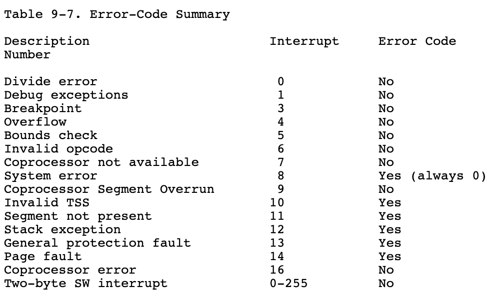
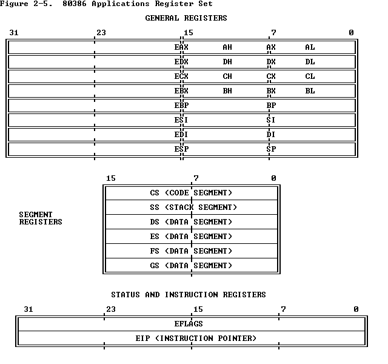
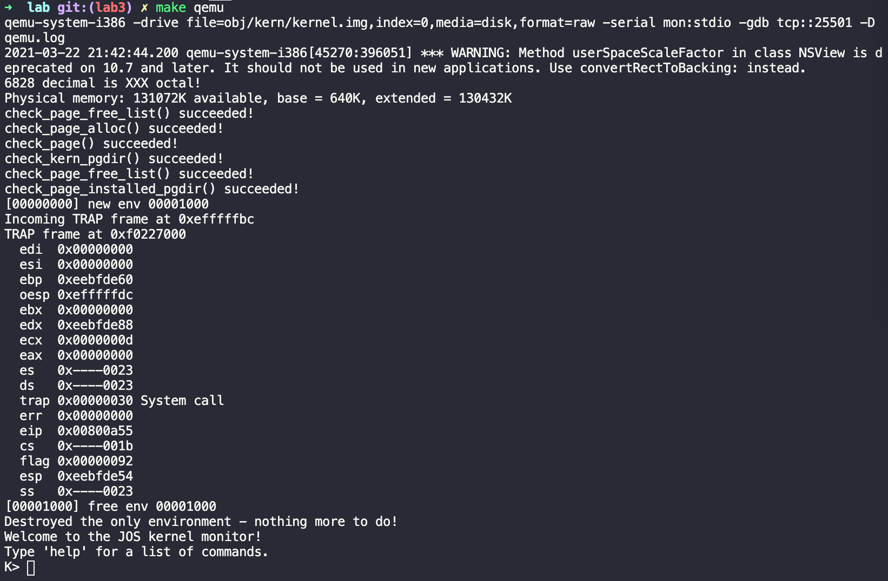

# Lab 3: User Environments, Part A

## Exercise 1

Just code as we did before. Note that ``envs`` represents all environments, so we have to map ``NENV`` amount of ``struct Env``.

```c
envs = (struct Env *) boot_alloc(NENV * sizeof(struct Env));

boot_map_region(kern_pgdir, UENVS, ROUNDUP(NENV * sizeof(struct Env), PGSIZE), PADDR(envs), PTE_U);
```

## Exercise 2

### 1. env_init()

Code as the instruction mentioned. Note the order to insert each environment, and make sure the head of final ``env_free_list`` is ``envs[0]``.

```c
void
env_init(void)
{
	// Set up envs array
	// LAB 3: Your code here.
	int i;

	for (i = NENV - 1; i >= 0; --i) {
		envs[i].env_status = ENV_FREE;
		envs[i].env_id = 0;
		envs[i].env_link = env_free_list;
        // Set the new head for each iteration
		env_free_list = &envs[i];
    }

	// Per-CPU part of the initialization
	env_init_percpu();
}

```

### 2. env_setup_vm()

The thing this function does is to allocate a page directory and set the pointer to the new page directory ``e->env_pgdir``(and we could use ``kern_pgdir`` as a template). Then initialize the kernel portion of the new environment's virtual address space. Since ``page_alloc`` has been called and ``p`` has already assigned, we won't make any more calls to it.

```c
static int
env_setup_vm(struct Env *e)
{
	int i;
	struct PageInfo *p = NULL;

	// Allocate a page for the page directory
	if (!(p = page_alloc(ALLOC_ZERO)))
		return -E_NO_MEM;
	
	...
	// LAB 3: Your code here.
	p->pp_ref++;
	e->env_pgdir = (pde_t *) page2kva(p);

	// Map the VA below UTOP, which is empty
	memset(e->env_pgdir, 0, PDX(UTOP));

	// Map the VA above UTOP, use kern_pgdir as the template
	for (i = PDX(UTOP); i < NPDENTRIES; ++i) {
		e->env_pgdir[i] = kern_pgdir[i];
	}

	// UVPT maps the env's own page table read-only.
	// Permissions: kernel R, user R
	e->env_pgdir[PDX(UVPT)] = PADDR(e->env_pgdir) | PTE_P | PTE_U;

	return 0;
}
```

### 3. region_alloc()

We will use ``ROUNDDOWN`` and ``ROUNDUP`` macros to align the virtual address ``va`` and ``va + len`` to make things easier to allocate by pages.

Note there are some corner cases:
- ``len < 0``
- ``len == 0``
- ``va + len`` could be above the kernel stack top ``KSTACKTOP``, and we cannot make it happen for sure
- We cannot allocate a new page
- We cannot insert a new page

```c
static void
region_alloc(struct Env *e, void *va, size_t len)
{
	// LAB 3: Your code here.
	...
	assert(len >= 0);
	assert((uintptr_t) va + len < KSTACKTOP);

	if (len == 0) return;

	uintptr_t addr_start = (uintptr_t) ROUNDDOWN(va, PGSIZE);
	uintptr_t addr_end = (uintptr_t) ROUNDUP(va + len, PGSIZE);
	struct PageInfo *p = NULL;
	uintptr_t addr;

	for (addr = addr_start; addr < addr_end; addr += PGSIZE) {
		p = page_alloc(0);
		if (p == NULL) {
			panic("region_alloc(): no free page, allocation failed.");
		}
		if (page_insert(e->env_pgdir, p, (void *) addr, PTE_W | PTE_U) == -E_NO_MEM) {
			panic("region_alloc(): error 4: no memory.");
		}
	}
}
```

### 4. load_icode()

Things to do: Load all loadable segments from the ELF binary image into the environment's user memory.

- Make sure the segments start at the **appropriate** address
- Save the entry page directory, like the bootloader did
- Zero ANY portion of these segments not actually present in the ELF file
- Map one page for the program's inital stack

The code is similar to ``bootmain`` in ``boot/main.c`` :)

Take a look at ``inc/elf.h``:
```c
uint32_t e_magic;	// must equal ELF_MAGIC
```
So we have to check whether the entry of the segment equals to ``ELF_MAGIC``.

And also note this code snippet in ``kern/entry.S``:
```
# Load the physical address of entry_pgdir into cr3.  entry_pgdir
# is defined in entrypgdir.c.
movl	$(RELOC(entry_pgdir)), %eax
movl	%eax, %cr3
```
Such behavior is also in ``kern/pmap.c``:
```c
// Switch from the minimal entry page directory to the full kern_pgdir
// page table we just created.	Our instruction pointer should be
// somewhere between KERNBASE and KERNBASE+4MB right now, which is
// mapped the same way by both page tables.
//
// If the machine reboots at this point, you've probably set up your
// kern_pgdir wrong.
lcr3(PADDR(kern_pgdir));
```

To conclude, we have to use ``lcr3`` to **switch from 
the page directory to the page table**.

Moreover, 
> You must also do something with the program's entry point, to make sure that the environment starts executing there.

Note **Basics of Protected Control Transfer** in the handout of Lab 3:
> From the appropriate entry in this table the processor loads: the value to load into the instruction pointer (``EIP``) register, pointing to the kernel code designated to handle that type of exception.

And now take a glance at ``env_alloc`` in ``kern/env.c``:

```c
// Set up appropriate initial values for the segment registers.
// GD_UD is the user data segment selector in the GDT, and
// GD_UT is the user text segment selector (see inc/memlayout.h).
// The low 2 bits of each segment register contains the
// Requestor Privilege Level (RPL); 3 means user mode.  When
// we switch privilege levels, the hardware does various
// checks involving the RPL and the Descriptor Privilege Level
// (DPL) stored in the descriptors themselves.
e->env_tf.tf_ds = GD_UD | 3;
e->env_tf.tf_es = GD_UD | 3;
e->env_tf.tf_ss = GD_UD | 3;
e->env_tf.tf_esp = USTACKTOP;
e->env_tf.tf_cs = GD_UT | 3;
// You will set e->env_tf.tf_eip later.
```

> You will set e->env_tf.tf_eip later.

Now we've got the idea. \*smirk\*

Be aware of corner cases again :)
- ``elfhdr->e_magic != ELF_MAGIC``
- ``ph->p_filesz > ph->p_memsz``

```c
static void
load_icode(struct Env *e, uint8_t *binary)
{
    // LAB 3: Your code here.
	struct Elf * elfhdr = (struct Elf *) binary;
	struct Proghdr *ph, *eph;
	assert(elfhdr->e_magic == ELF_MAGIC);
	
	// Switch from the page directory to the table table
	lcr3(PADDR(e->env_pgdir));
	
	ph = (struct Proghdr *) (binary + elfhdr->e_phoff);
	eph = ph + elfhdr->e_phnum;
	for (; ph < eph; ++ph) {
		// Only load segments with ph->p_type == ELF_PROG_LOAD
		if (ph->p_type != ELF_PROG_LOAD) {
			continue;
		}
		if (ph->p_filesz > ph->p_memsz) {
			panic("load_icode: the file of program header is too large to allocate.");
		}
		region_alloc(e, (void *) ph->p_va, ph->p_memsz);
		memmove((void *) ph->p_va, binary + ph->p_offset, ph->p_filesz);
		memset((void *) (ph->p_va + ph->p_filesz), 0, ph->p_memsz - ph->p_filesz);
	}

	// Now map one page for the program's initial stack
	// at virtual address USTACKTOP - PGSIZE.

	// LAB 3: Your code here.
	region_alloc(e, (void *) (USTACKTOP - PGSIZE), PGSIZE);
    // As mentioned in env_alloc
	e->env_tf.tf_eip = elfhdr->e_entry;
}
```

### 5. env_create()

Code as instruction mentioned. Note the type casting when allocating a new environment.

```c
void
env_create(uint8_t *binary, enum EnvType type)
{
	// LAB 3: Your code here.
	struct Env * newenv;
	if (env_alloc(&newenv, 0) < 0) {
		panic("env_create(): env_alloc failed.");
	}

	load_icode(newenv, binary);
	newenv->env_type = type;
}
```

### 6. env_run()

The instruction is clear to write the code.

```c
void
env_run(struct Env *e)
{
	// LAB 3: Your code here.
	if (curenv != NULL && curenv->env_status == ENV_RUNNING) {
		e->env_status = ENV_RUNNABLE;
	}

	curenv = e;
	curenv->env_status = ENV_RUNNING;
	curenv->env_runs++;
	lcr3(PADDR(curenv->env_pgdir));

	env_pop_tf(&(curenv->env_tf));
}

```

## Exercise 4

As mentioned in the description, we have to do some modifications to ``trapentry.S`` and ``trap.c``.

### 1. trapentry.S

> You will need to add an entry point in trapentry.S (using those macros) for each trap defined in inc/trap.h, and you'll have to provide _alltraps which the TRAPHANDLER macros refer to. 

To add an entry point in ``trapentry.S``, we'd better note these two functions:
```
/* TRAPHANDLER defines a globally-visible function for handling a trap.
 ...
 */
#define TRAPHANDLER(name, num)						\
	.globl name;		/* define global symbol for 'name' */	\
	.type name, @function;	/* symbol type is function */		\
	.align 2;		/* align function definition */		\
	name:			/* function starts here */		\
	pushl $(num);							\
	jmp _alltraps

/* Use TRAPHANDLER_NOEC for traps where the CPU doesn't push an error code.
 * It pushes a 0 in place of the error code, so the trap frame has the same
 * format in either case.
 */
#define TRAPHANDLER_NOEC(name, num)					\
	.globl name;							\
	.type name, @function;						\
	.align 2;							\
	name:								\
	pushl $0;							\
	pushl $(num);							\
	jmp _alltraps
```
We have to identify the two different cases and use these macros case by case. Look at [section 9.10 of the i386 reference](https://pdos.csail.mit.edu/6.828/2018/readings/i386/s09_10.htm):



The thing we need to do is to bind the handler defined to the constants defined in ``inc/trap.h``.

```
.text

/*
 * Lab 3: Your code here for generating entry points for the different traps.
 */
TRAPHANDLER_NOEC(handler_divide, T_DIVIDE)
TRAPHANDLER_NOEC(handler_debug, T_DEBUG)
TRAPHANDLER_NOEC(handler_nmi, T_NMI)
TRAPHANDLER_NOEC(handler_brkpt, T_BRKPT)
TRAPHANDLER_NOEC(handler_oflow, T_OFLOW)
TRAPHANDLER_NOEC(handler_bound, T_BOUND)
TRAPHANDLER_NOEC(handler_illop, T_ILLOP)
TRAPHANDLER_NOEC(handler_device, T_DEVICE)
TRAPHANDLER_NOEC(handler_fperr, T_FPERR)
TRAPHANDLER_NOEC(handler_mchk, T_MCHK)
TRAPHANDLER_NOEC(handler_simderr, T_SIMDERR)

TRAPHANDLER(handler_dblflt, T_DBLFLT)
TRAPHANDLER(handler_tss, T_TSS)
TRAPHANDLER(handler_segnp, T_SEGNP)
TRAPHANDLER(handler_stack, T_STACK)
TRAPHANDLER(handler_gpflt, T_GPFLT)
TRAPHANDLER(handler_pgflt, T_PGFLT)
TRAPHANDLER(handler_align, T_ALIGN)

TRAPHANDLER_NOEC(handler_syscall, T_SYSCALL)
```

Then we fill the function ``_alltraps``.
> Your ``_alltraps`` should: push values to make the stack look like a ``struct Trapframe``

Now we take a look at the definition of ``struct Trapframe`` in ``inc/trap.h``:
```c
struct Trapframe {
	struct PushRegs tf_regs;
	uint16_t tf_es;
	uint16_t tf_padding1;
	uint16_t tf_ds;
	uint16_t tf_padding2;
	uint32_t tf_trapno;
	...
} __attribute__((packed));
```

The ``pushal`` instruction stores the 16-bit or 32-bit general registers, referring to [chapter 17 of the i386 reference](https://pdos.csail.mit.edu/6.828/2018/readings/i386/PUSHA.htm), without saving ``ds``and ``es``, so we should push values of the register ``ds`` and ``es``. Now take a look at [section 2.3.2 of the i386 reference](https://pdos.csail.mit.edu/6.828/2018/readings/i386/s02_03.htm). Since the size of data in these registers are 2 bytes, we need to use the instruction ``pushl`` to push values in these two registers. When it comes to ``$GD_KD``, since its size is smaller than a byte(``WORD``), we can use the mov instruction for the minimal size of data ``movw`` instead of ``movl``.



```
/*
 * Lab 3: Your code here for _alltraps
 */
 _alltraps:
	pushl %ds
	pushl %es
	pushal

	movw $(GD_KD), %ax
	movw %ax, %ds
	movw %ax, %es

	pushl %esp
	call trap
```

### 2. trap.c

> the SETGATE macro will be helpful here. 

Now we take a glance at ``SETGATE`` macro in ``inc/mmu.h``:
```c
#define SETGATE(gate, istrap, sel, off, dpl)			\
{								\
	(gate).gd_off_15_0 = (uint32_t) (off) & 0xffff;		\
	(gate).gd_sel = (sel);					\
	(gate).gd_args = 0;					\
	(gate).gd_rsv1 = 0;					\
	(gate).gd_type = (istrap) ? STS_TG32 : STS_IG32;	\
	(gate).gd_s = 0;					\
	(gate).gd_dpl = (dpl);					\
	(gate).gd_p = 1;					\
	(gate).gd_off_31_16 = (uint32_t) (off) >> 16;		\
}
```

> Set up a normal interrupt/trap gate descriptor.
> - istrap: 1 for a trap (= exception) gate, 0 for an interrupt gate. 
> 
>   see [section 9.6.1.3 of the i386 reference](https://pdos.csail.mit.edu/6.828/2018/readings/i386/s09_06.htm): "The difference between an interrupt gate and a trap gate is in the effect on ``IF`` (the interrupt-enable flag). An interrupt that vectors through an interrupt gate resets ``IF``, thereby preventing other interrupts from interfering with the current interrupt handler. A subsequent ``IRET`` instruction restores ``IF`` to the value in the ``EFLAGS`` image on the stack. An interrupt through a trap gate does not change ``IF``."
> - sel: Code segment selector for interrupt/trap handler
> - off: Offset in code segment for interrupt/trap handler
> - dpl: Descriptor Privilege Level - the privilege level required for software to invoke this interrupt/trap gate explicitly using an int instruction.

Note that this function only set up either **an interrupt gate** or **a trap gate**.

P.S. If you would like to know all the properties in the ``SETGATE`` marco, you can also take a look at ``struct Gatedesc`` in ``inc/mmu.h``:
```c
// Gate descriptors for interrupts and traps
struct Gatedesc {
	unsigned gd_off_15_0 : 16;   // low 16 bits of offset in segment
	unsigned gd_sel : 16;        // segment selector
	unsigned gd_args : 5;        // # args, 0 for interrupt/trap gates
	unsigned gd_rsv1 : 3;        // reserved(should be zero I guess)
	unsigned gd_type : 4;        // type(STS_{TG,IG32,TG32})
	unsigned gd_s : 1;           // must be 0 (system)
	unsigned gd_dpl : 2;         // descriptor(meaning new) privilege level
	unsigned gd_p : 1;           // Present
	unsigned gd_off_31_16 : 16;  // high bits of offset in segment
};
```
And [section 9.5 of the i386 reference](https://pdos.csail.mit.edu/6.828/2018/readings/i386/s09_05.htm).


Format like ``unsigned gd_off_15_0 : 16;`` is putting ``:bit`` length after the variable, allowing the packing of data in a structure. The JOS kernel uses the lower 5 bits to store ``gd_type`` and ``gd_s``.

Note that ``gd_dpl``(privilege level) must be 0 to ensure that the privilege rule is never violated in JOS kernel. The other alternative way is **to place the handler in a conforming segment**.

Here we use ``SETGATE`` to set up all the interrupts to the kernel text:
> You shouldn't call a TRAPHANDLER function from C, but you may need to _declare_ one in C (for instance, to get a function pointer during IDT setup).  You can declare the function with ``void NAME();`` where ``NAME`` is the argument passed to TRAPHANDLER.
```c
// Don't forget to declare these functions!
extern void handler_divide();
extern void handler_debug();
extern void handler_nmi();
extern void handler_brkpt();
extern void handler_oflow();
extern void handler_bound();
extern void handler_illop();
extern void handler_device();
extern void handler_dblflt();
extern void handler_tss();
extern void handler_segnp();
extern void handler_stack();
extern void handler_gpflt();
extern void handler_pgflt();
extern void handler_fperr();
extern void handler_align();
extern void handler_mchk();
extern void handler_simderr();
extern void handler_syscall();
extern void handler_default();

...

void
trap_init(void)
{
	extern struct Segdesc gdt[];

	// LAB 3: Your code here.
    SETGATE(idt[T_DIVIDE], false, GD_KT, handler_divide, 0);
    SETGATE(idt[T_DEBUG], false, GD_KT, handler_debug, 0);
    SETGATE(idt[T_NMI], false, GD_KT, handler_nmi, 0);
    SETGATE(idt[T_BRKPT], false, GD_KT, handler_brkpt, 3);
    SETGATE(idt[T_OFLOW], false, GD_KT, handler_oflow, 0);
    SETGATE(idt[T_BOUND], false, GD_KT, handler_bound, 0);
    SETGATE(idt[T_ILLOP], false, GD_KT, handler_illop, 0);
    SETGATE(idt[T_DEVICE], false, GD_KT, handler_device, 0);
    SETGATE(idt[T_DBLFLT], false, GD_KT, handler_dblflt, 0);
    SETGATE(idt[T_TSS], false, GD_KT, handler_tss, 0);
    SETGATE(idt[T_SEGNP], false, GD_KT, handler_segnp, 0);
    SETGATE(idt[T_STACK], false, GD_KT, handler_stack, 0);
    SETGATE(idt[T_GPFLT], false, GD_KT, handler_gpflt, 0);
    SETGATE(idt[T_PGFLT], false, GD_KT, handler_pgflt, 0);
    SETGATE(idt[T_FPERR], false, GD_KT, handler_fperr, 0);
    SETGATE(idt[T_ALIGN], false, GD_KT, handler_align, 0);
    SETGATE(idt[T_MCHK], false, GD_KT, handler_mchk, 0);
    SETGATE(idt[T_SIMDERR], false, GD_KT, handler_simderr, 0);
    SETGATE(idt[T_SYSCALL], false, GD_KT, handler_syscall, 3);

    // Per-CPU setup 
	trap_init_percpu();
}
```

## Summing Up

Now run ``make qemu`` to run the JOS kernel. If things goes well, your command interface will look like this:



You can also run ``make grade`` to see how many marks you have gained in part A.

## Questions

To be finished